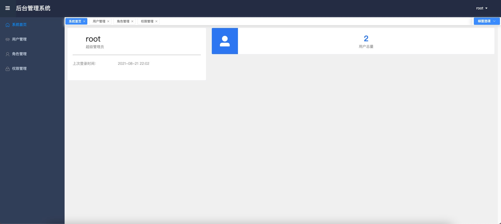
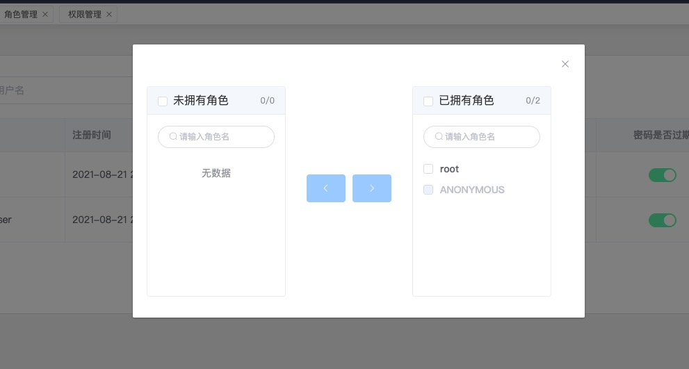
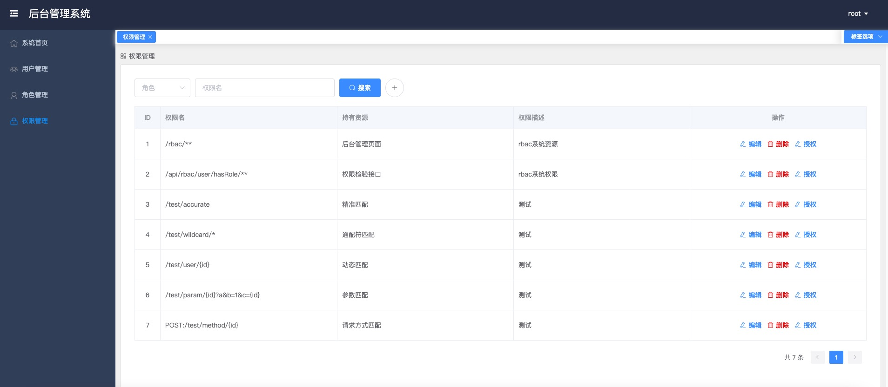

# spring-security-rbac
Spring security rbac增强组件，可视化权限管理，增加自定义权限匹配规则，针对传统rbac进行了大量性能优化。
[spring-security-rbac](https://churunfa.github.io/spring-security-rbac/)

# 前端
基于[vue-manage-system](https://github.com/lin-xin/vue-manage-system)修改






# 安装运行

1.在自己项目中导入坐标
```
<dependency>
  <groupId>io.github.churunfa</groupId>
  <artifactId>spring-boot-security-rbac-starter</artifactId>
  <version>1.0.0-RELEASE</version>
</dependency>
```
2.配置redis、mysql、导入spring-boot-starter-web

3.运行sql文件(public/rbac.sql)，创建rbac基础数据表

4.启动项目访问http://localhost:8080/rbac


# 使用

一、角色
1. root角色：拥有所有权限，任何情况下不会拦截
2. ANONYMOUS：匿名角色，描述不需要拦截的资源，所有用户均拥有该角色。其中anonymousUser只允许拥有该角色，anonymousUser表示未登陆的用户

二、权限配置

1.精准匹配模式：

例：```/test/accurate```

2.通配符匹配模式：

*可匹配一层目录，**可以匹配任意层目录

例：
```/test/wildcard/*``` 可以匹配```/test/wildcard/a```、```/test/wildcard/b```，但是```/test/wildcard/a/b```则会匹配失败

```/test/wildcard/**``` 可以匹配所有以```/test/wildcard/```开头的url

3.动态匹配模式：

可以根据当前登陆用户的某些信息进行匹配

例如：```/test/user/{id}```，假设当前登陆用户为非root用户，并且id为5，则该用户拥有访问```/test/user/5```的权限

通配符使用范围：

数据库用户表的映射类中所有的属性都可以作为通配符使用

4.参数匹配模式:

根据参数匹配，其中参数可以是在url中，也可以是表单提交，也可以在json中提交

例：```/test/param/{id}?a&b=1&c={id}```表示参数必须包含a，并且b的值必须等于1，并且c的值必须等于用户id的请求才拥有权限

5.请求方式匹配模式：

可以在权限中添加请求前缀进行匹配

支持```GET```、```POST```、```PUT```、```DELETE```，必须大写

例：```POST:/test/method/{id}```

三、参数配置
```
security-rbac:
  uri-prefix:  # 需要进行权限控制的url前缀，例如: /api 表示只对api开头的url进行权限认证，默认为空，即对所有权限都进行验证
  rbac-user-class-str: # 用户表全包名，当需要自定义用户表时，将自定义用户表继承RbacUser并配置该属性
  auth-whitelist: # 认证白名单，该列表中配置的项直接放行
  auto-create-root-account: # true或false，表示项目启动时是否自动创建root用户、匿名用户等权限相关信息，默认true
  token-expiration: # 配置用户认证默认过期时间
  user-table-name: # 数据库中用户表的表名，默认为user
```
